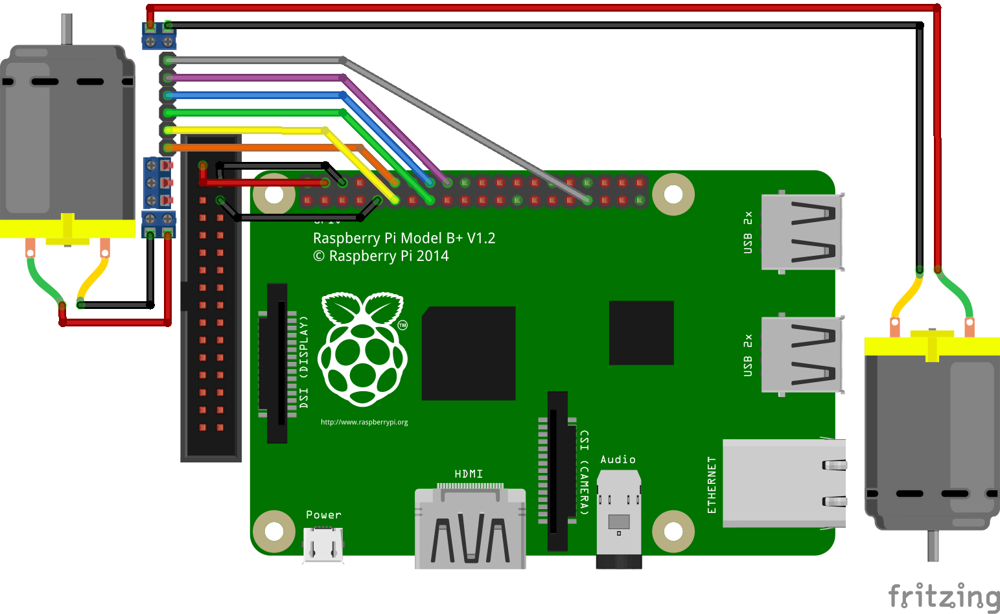

# UGV

Unmanned Ground Vehicle

## Hardware Setup

The UGV motors are controlled by an L298N Dual H-Bridge Driver connected to a Raspberry Pi.

Raspberry Pi is normally USB powered but can also be powered over GPIO power pins (+5V/Ground). This bypasses power protection circuitry for unstable supplies, but the Pixhawk provides regulated 5V pins. This provides enough power for headless operation. In the event that a monitor is needed, it will draw too much power and shut off; unplug the +5V supply pin and plug in USB power (don't connect both at the same time). If using the signals, ensure that the ground pin remains connected to the Pixhawk in order to provide a common ground with the L298N or else they will not work.

We should measure the current draw by the Pi from the Pixhawk under load to see what the maximum is before shut off. In the future we should try tapping 5V directly from the power module to see if this will allow for more current.

Pi 4 and up are annoying because of the switch to mini-HDMI port, for which cables are not as readily available. For this reason, consider going back to Pi 3 if the extra compute power is not needed.

### Wiring Diagram



The wiring diagram was made in [Fritzing](https://fritzing.org/). The source file is included in this repository so you can edit it if needed. Fritzing will also show you what the pins are on the Pi when you hover over them in the program.

Pi GPIO pin reference: https://pinout.xyz/

Different GPIO pins can be used; just adjust the code accordingly.

The top row of pins on the Pixhawk is ground; the middle row is 5V. See https://ardupilot.org/copter/docs/common-pixhawk-overview.html

## Software Setup

For wireless communication we connect to the Pi over eduroam using SSH.

The password is not your normal password that you use to log in to your MyCPP portal. Rather it is a separate network password that you can set by going to https://apps.cpp.edu/

To enable incoming SSH connections on the Pi, open Preferences > Raspberry Pi Configuration. Go to the Interfaces tab. Ensure the SSH radio button is set to Enable and click OK.

On the Pi, run
```sh
hostname -I
```
to determine its IP address, which looks something like this.
```
10.110.xxx.xxx
```
Use this for the following steps.

On your computer, run
```sh
ssh pi@10.110.xxx.xxx
```
to connect to the Pi.

Get the code on the Pi, either by cloning this repository
```sh
git clone https://github.com/dennisleexyz/uhv
cd uhv/ugv
```
or just copying it over from your local machine
```sh
scp ugv.py pi@10.110.xxx.xxx:
```

Run it
```sh
python3 ugv.py
```

`WASD` is Up/Left/Down/Right, `J` and `K` to lower and raise PWM duty cycle respectively to the motors. Warning: duty cycle starts at full speed by default.

The IP address is not stable, it is subject to change periodically. Expect that you will need to re-acquire it.

### Raspbian

Raspbian's UI for connecting to a network does not support WPA Enterprise networks, e.g. eduroam. We can install NetworkManager and use that instead, disabling the default.

```sh
sudo apt install network-manager{,-gnome}
sudo systemctl disable --now dhcpcd
sudo systemctl enable --now network-manager
setsid nm-applet
```

See https://raspberrypi.stackexchange.com/a/119653

# Troubleshooting

The battery connector may need to be replaced e.g. in the event that the battery is plugged in backwards (reverse polarity). When replacing the connector, care will need to be taken to ensure that the two terminals do not short. Use the yellow XT90 connectors, which are on all of the batteries in the lab and not prone to being plugged in backwards like the blue connectors.

Cut the wire directly underneath just one of the connector terminals, using a sufficiently small wire cutter to prevent sparking with the other terminal. Place the connector sleeve on the wire. Strip and solder the wire to the correct solder cup (ensure the same polarity) on the new connector. Ensure continuity between the inside connector terminal and the solder (not the cup) using a multimeter. Insulate the new solder joint with Kapton tape. Now cut the wire directly underneath the old connector on the other terminal. Ensure the connector sleeve is on both wires before stripping and soldering the second wire, or you will have to desolder to put it on. After soldering the second wire and testing continuity, push the sleeve onto the new connector. You may have to remove the Kapton tape first.
